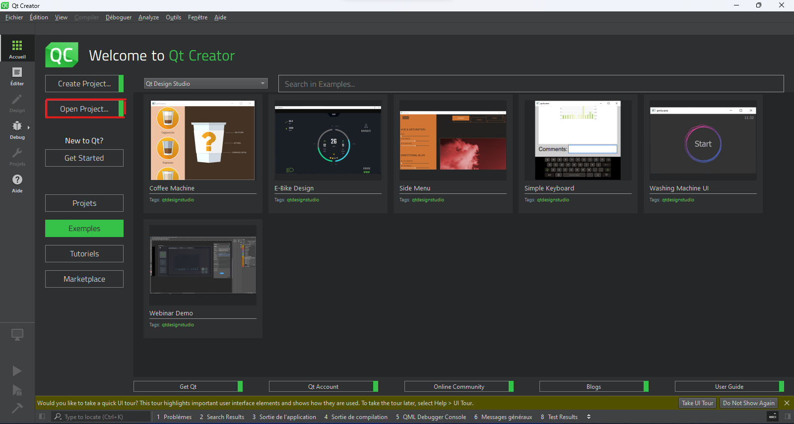
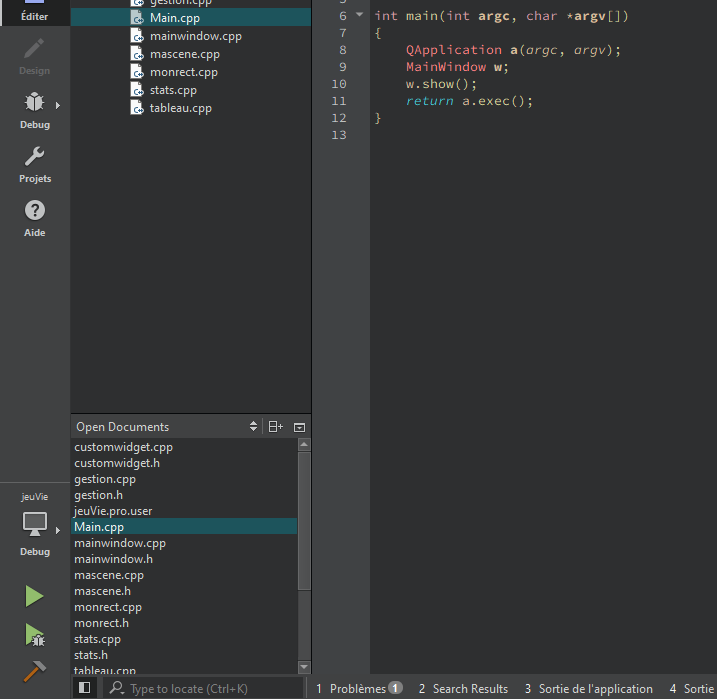

# Jeu de la vie ◼️

> Auteur : DOURNEL Frédéric

## But du projet 📍

Ce projet est un projet que j'ai dû faire durant le 2ème semestre de BUT informatique. J'ai dû réalisé un jeu de la vie avec quelque paramètre sur l'état initial du plateau (génération random, en damier...) mais aussi pour les bordures du tableau (tores ou non).

## Technologies utilisées

Ce projet à été réalisé en C++ avec une interface graphique créé avec Qt Creator.

    
    

Qt Creator : https://www.qt.io/product/development-tools

## How to use ❓

- Launch the project in Qt creator.

- Open the project.

    

- Execute the *main.cpp* file.

    

